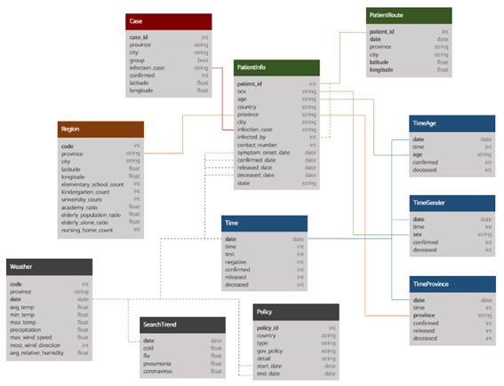

# PRAC-Visualització de dades

El COVID-19 va ser una pandèmia mundial que va canviar la nostra societat. Ha sigut tema d'estudi arreu del món. En aquest projecte ens centrarem en la població de Corea del Sud. Es tracta d'una base de dades que consta de 10 arxius, basats en els informes de KCDC (Korea Centers for Disease Control & Prevention) i el govern local.

## Datasets
### 1 Informació dels casos
**Case**: Casos d’infeccions de COVID-19 a Corea del Sud.
### 2 Informació dels pacients
**PatientInfo**: Informació epidemiològica dels pacients de COVID-19 a Corea del Sud.
### 3 Informació sobre les series temporals
**Time**: Sèrie temporal sobre els estats de COVID-19 a Corea del Sud. 
**TimeAge**: Sèrie temporal sobre els estats de COVID-19 en termes d’edat a Corea del Sud. 
**TimeGender**: Sèrie temporal sobre els estats de COVID-19 en termes de gènere a Corea del Sud. 
**TimeProvince**: Sèrie temporal sobre els estats de COVID-19 en termes de província a Corea del Sud.
### 4 Informació adicional
**Region**: Informació de les diferents regions de Corea del Sud. 
**Weather**: Informació del temps en les regions de Corea del Sud. 
**SearchTrend**: Informació de la tendència de busca de paraules en NAVER. Un dels portals més grans a Corea del Sud. 
**Policy**: Infromació de la política del govern pel COVID-19 a Corea del Sud.

## Relació entre els datasets

